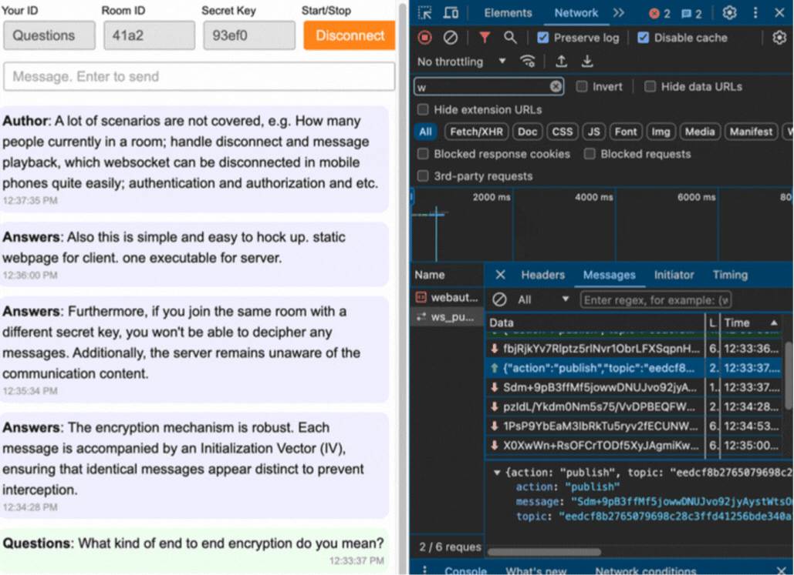

## Ad hoc E2E Encrypted Group Chat

### What
This project is a fully functional, minimalist, ad hoc, end-to-end encrypted web group chat. It uses websocket for all message delivery which is more reliable than WebRTC.

### Why
At times, there's a need for private, anonymous group chats. Many existing applications with end-to-end encryption are overly complex. Conversely, simpler applications lack both end-to-end encryption and group functionality. Hence, I invested a few days to develop one myself. It primarily serves as a proof of concept.

### How
The backend is implemented using WebSockets written in Golang. I made minimal modifications based on https://github.com/madeindra/golang-websocket

On the client side, I opted for handwritten, plain JavaScript, avoiding the use of complex frameworks.

### Demo

A live demo is at https://privapps.github.io/gchat/

### Alternative
* [My 1-on-1 e2e encryption chat using piping server](https://privapps.github.io/share/chat)
* [My 1-on-1 WebRTC chat with file sharing](https://privapps.github.io/share/)

For a more completed robusted solution, I would recommand to use [Ergo](https://github.com/ergochat/ergo) as backend and [Kiwi](https://kiwiirc.com/) as front end. A low end 100 MB RAM server can handle thousands of users.

If you are a big fan of building up a robust websocket chat solution, take a look at [this tutorial](https://centrifugal.dev/docs/tutorial/intro)
